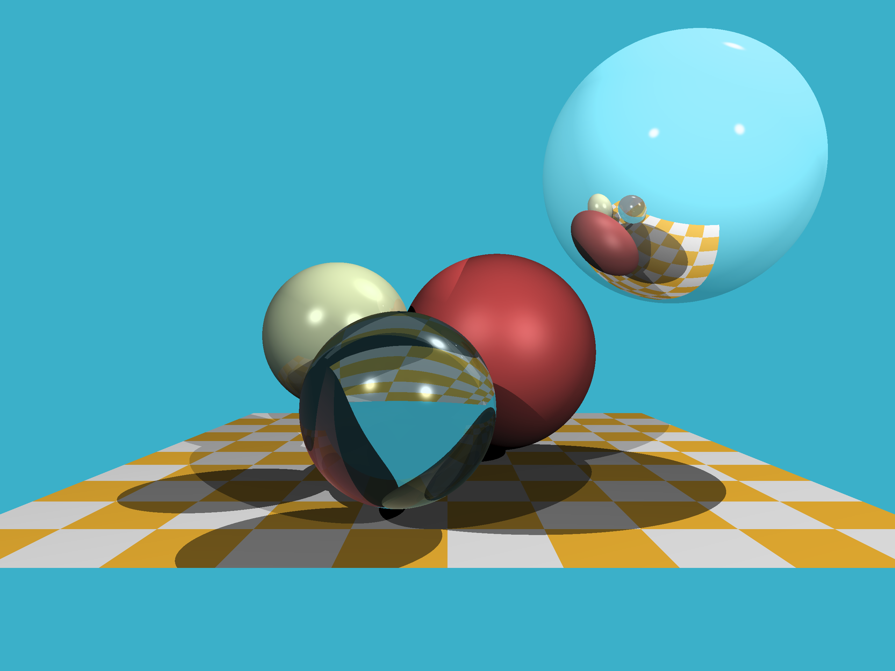
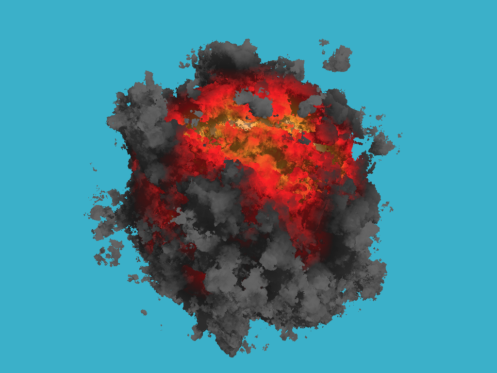

# Raytracer in Rust

Based on [tinyraytracer](https://github.com/ssloy/tinyraytracer) + [tinykaboom](https://github.com/ssloy/tinykaboom) articles by [Dmitry V. Sokolov](https://github.com/ssloy).

## Output

or

## Implementation
Dependencies are limited to 
* [rayon](https://github.com/rayon-rs/rayon) for multithreading, which can be easily removed;
* [num-traits](https://github.com/rust-num/num-traits) to make own implementation of vectors, based on const generics over fixed-size arrays.

Not using existing vector libraries is a conscious choice. It is also a conscious choice to manually generate [ppm images](https://ru.wikipedia.org/wiki/Portable_anymap) instead of using handy image manipulation crates.